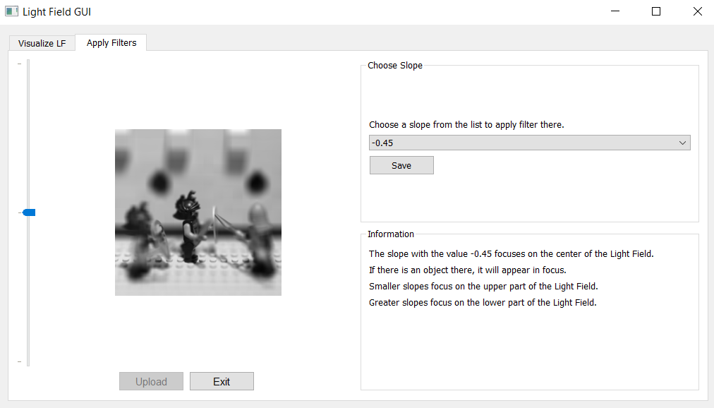

# Light-Field-Renderer
This project contains a tool written in Python 3.7 that can be used to visualize light fields.

# Installation Guidelines
Let's start with some installation guidelines that you need in order to run the project.
1. Clone this repository

2. Download the dataset from [here](https://drive.google.com/drive/folders/138X2FuErr7cYO8ww1dQBrEjj7G8q0mUr?usp=sharing) and save it anywhere you like.

3. Install dependencies listed in ``` requirements.txt ``` :
```bash 
pip3 install -r requirements.txt
```
4. Each of the files contains either a variable named ``` DATA_DIR ``` or a variable named ``` path ```.
Unless you saved the data directory directly inside the project, you need to set this variables to the corresponding path where your data is saved.

# Project Description
In this section the purpose of each component will be highlighted.
## LoadLF module
This module is used to read the 4D light field. As the light field camera consists of an array of lenslets instead of a single lens it takes, in a single snapshot, multiple images from different angles.
We choose for the parametrization of the light field, as described in [...], the intersection of the lines between two parallel planes, conventionally denoted with _(u,v)_ for the first plane and _(s,t)_ for the second.
Therefore, with the indices _(u,v)_, one can access the lenslet of the light field and with the indices _(s,t)_ one can access an image behind a lenslet.

Here's an example of how the parametrization of the light field looks like:


Here's an example of how a light field camera looks like. It resembles a hand-held camera: 


## LFRenderer module
This module is used to render from the light field.
Given a light field that is parameterized as above, one can render views from the light field by placing a virtual camera in the world, artificially constructing light rays that enter the camera and intersecting them with the image plane by using the projection matrix.  

Here are some examples of rendered images:

 

## LFFilter module
This module applies the shift sum filter to the rendered images from a light field.
This filter is used for refocusing purposes.
By choosing different so called slopes in the rendered images, one can visualize how the filter focuses that chosen area and blurs the outside area.

Here is an example of filtered image:


## LFGUI module
This last module combines all the modules from above in a single Graphical User Interface that consists of two tabs.
In the first tab one can upload and visualize various light fields in different ways. Additionally, one can also export GIFs of the light fields.
The second tab is used to illustrate the one shift sum filter applied at different depths.

The two tabs of the GUI can be visualized here:

 
